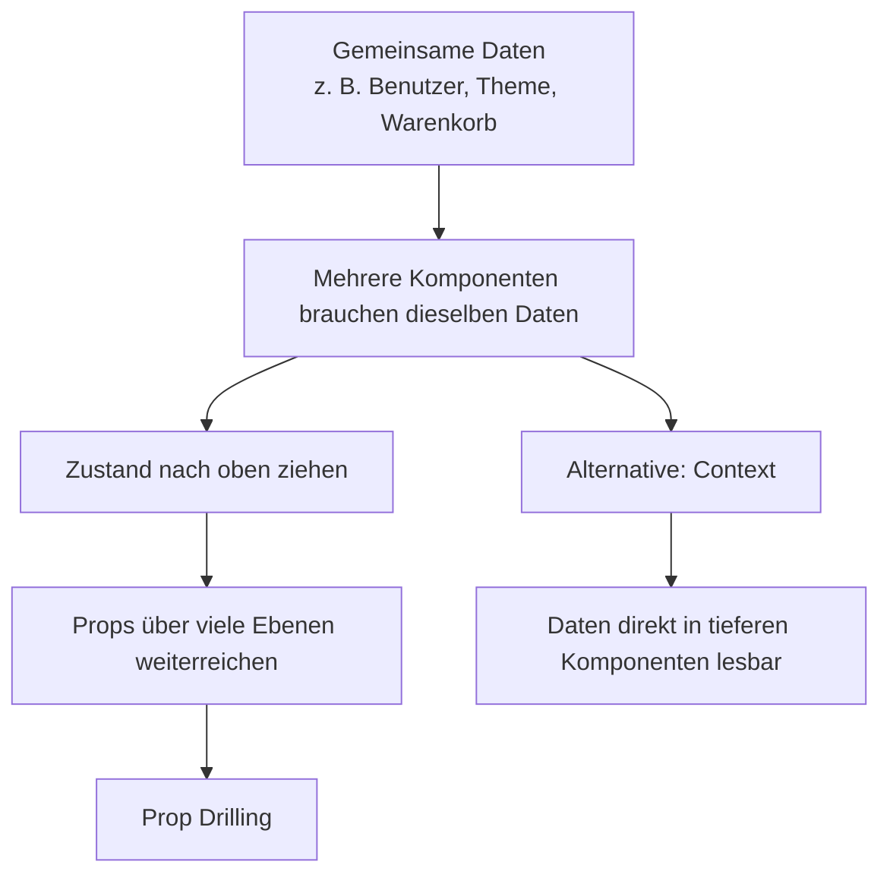
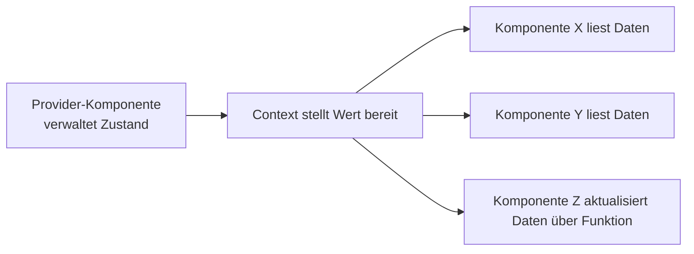

###### Themen

Globale Zustandsverwaltung in React

- Motivation und Herausforderungen beim globalen State-Management
- Unterschiede zwischen lokalem und globalem Zustand
- Wann Context sinnvoll ist und wann nicht

React Context API

- Grundlagen und Prinzip der Context API
- Erstellen und Bereitstellen eines eigenen Contexts
- Globale Daten in Komponenten lesen und verwenden

# 🌍 Globale Zustandsverwaltung in React

Wenn du mit React beginnst, arbeitet fast alles erst einmal wunderbar mit **lokalem Zustand**. Eine Komponente hat ein Eingabefeld, einen Button oder einen geöffnet/geschlossen-Schalter für ein Menü, und genau diese Komponente verwaltet ihren eigenen Zustand mit `useState`. Das ist einfach, übersichtlich und meistens auch die beste Lösung.

Sobald aber **mehrere Komponenten dieselben Daten brauchen**, wird es komplizierter. Stell dir vor, du hast den aktuell angemeldeten Benutzer, das gewählte Theme, die Sprache, den Warenkorb oder Filtereinstellungen. Diese Daten werden oft nicht nur an einer Stelle gebraucht, sondern gleichzeitig im Header, in einer Sidebar, auf einer Produktseite und vielleicht auch noch in einem Formular. React empfiehlt grundsätzlich, gemeinsamen Zustand zu der nächsten gemeinsamen Elternkomponente „nach oben zu ziehen“ ([Sharing State Between Components](https://react.dev/learn/sharing-state-between-components)). Genau hier entsteht in größeren Anwendungen aber schnell organisatorischer Druck.



<br><br><br>
## 🎯 Motivation und Herausforderungen beim globalen State-Management

Der wichtigste Grund für globale Zustandsverwaltung ist: **bestimmte Daten gehören nicht nur einer einzelnen Komponente**. Sie betreffen einen größeren Teil der Anwendung. Wenn du solche Daten nur lokal speicherst, entstehen schnell mehrere Kopien derselben Information. Dann kann es passieren, dass eine Komponente „dunkles Theme“ anzeigt, während eine andere noch „helles Theme“ glaubt. Globales State-Management soll dafür sorgen, dass es **eine verlässliche Quelle** für diese Daten gibt.

Ein typisches Problem ist das sogenannte **Prop Drilling**. Damit ist gemeint, dass Daten durch mehrere Zwischenkomponenten als Props weitergereicht werden, obwohl diese Zwischenkomponenten die Daten selbst gar nicht brauchen. React beschreibt Context genau als Lösung für den Fall, dass du Informationen tief im Komponentenbaum verfügbar machen möchtest, ohne Props durch viele Ebenen durchreichen zu müssen ([Passing Data Deeply with Context](https://react.dev/learn/passing-data-deeply-with-context)). Prop Drilling ist nicht „verboten“, aber es macht den Code oft unnötig verkabelt: Eltern kennen zu viele Details ihrer Kinder, und Änderungen an Datenflüssen ziehen sich durch viele Dateien.

Eine zweite Herausforderung ist die **Verantwortung für Änderungen**. Wenn mehrere Komponenten denselben Zustand verändern dürfen, musst du sauber regeln, **wer** wann **was** aktualisiert. Sonst entstehen schwer nachvollziehbare Fehler. Das ist besonders wichtig bei Daten wie Authentifizierung, globalen Filtern oder komplexen Formularschritten. Je zentraler der Zustand wird, desto wichtiger wird eine klare Struktur.

Eine dritte Herausforderung betrifft die **Performance**. Wenn globaler Zustand geändert wird, können viele Komponenten betroffen sein. Bei React Context gilt: Wenn sich der `value` eines Providers ändert, rendert React alle Komponenten neu, die diesen Context lesen. Der Vergleich erfolgt dabei mit `Object.is` ([useContext](https://react.dev/reference/react/useContext)). Das ist funktional korrekt, kann aber problematisch werden, wenn du sehr viele, sehr häufig wechselnde Daten in einen einzigen Context packst.

Globales State-Management ist also nicht einfach nur „praktisch“, sondern immer ein Abwägen zwischen **Bequemlichkeit**, **Struktur**, **Nachvollziehbarkeit** und **Render-Kosten**. Genau deshalb ist es wichtig zu verstehen, wann globaler Zustand wirklich sinnvoll ist und wann lokaler Zustand die bessere Wahl bleibt.

<br><br><br>
## ⚖️ Unterschiede zwischen lokalem und globalem Zustand

Lokaler Zustand gehört in React normalerweise dorthin, wo er entsteht und gebraucht wird. Das ist der natürliche Standard. Erst wenn mehrere Komponenten denselben Zustand koordinieren müssen, hebt man ihn an eine gemeinsame Stelle an ([Sharing State Between Components](https://react.dev/learn/sharing-state-between-components)).

| Aspekt | Lokaler Zustand | Globaler Zustand |
|---|---|---|
| Gültigkeitsbereich | Nur eine Komponente oder ein kleiner Teilbaum | Mehrere, oft weit entfernte Komponenten |
| Typische Technik | `useState`, `useReducer` in einer Komponente | Context, Reducer + Context, externe Stores |
| Typische Beispiele | Input-Wert, Dropdown offen/zu, Tab-Auswahl | Aktueller Benutzer, Theme, Sprache, Warenkorb |
| Vorteil | Einfach, kapselt Logik sauber | Gemeinsame Daten an vielen Stellen verfügbar |
| Nachteil | Schwer teilbar über große Baumtiefe | Mehr Struktur nötig, mögliche unnötige Re-Renders |

Lokaler Zustand ist besonders gut, wenn die Information **nur eine einzelne UI-Stelle betrifft**. Ein Suchfeld speichert seinen aktuellen Eingabetext lokal. Ein Dialog speichert lokal, ob er offen ist. Ein Akkordeon speichert lokal, welcher Abschnitt aufgeklappt ist. Solcher Zustand muss nicht künstlich global gemacht werden, denn das würde die Anwendung unnötig komplizierter machen.

Globaler Zustand ist dann sinnvoll, wenn Daten **von mehreren Komponenten gelesen oder verändert** werden müssen. Wichtig ist dabei: „global“ bedeutet in React nicht automatisch „für die gesamte App“. Ein Context gilt immer nur für den Bereich des Komponentenbaums, der **unterhalb** seines Providers liegt ([useContext](https://react.dev/reference/react/useContext)). Du kannst also Zustand auch gezielt nur für einen App-Bereich global machen, etwa nur für einen Checkout-Prozess oder nur für einen Admin-Bereich.

Ein häufiger Denkfehler ist, globalen Zustand mit „wichtigerem Zustand“ gleichzusetzen. Das stimmt nicht. Ein Zustand wird nicht global, weil er wichtig ist, sondern weil er **geteilt** werden muss. Eine sehr wichtige Information kann lokal sein, wenn sie nur an einer Stelle gebraucht wird. Umgekehrt kann eine relativ einfache Information global sein, wenn sie an vielen Stellen gebraucht wird, zum Beispiel das aktuelle Farbschema.

<br><br><br>
## 🧭 Wann Context sinnvoll ist und wann nicht

Context ist sinnvoll, wenn du **dieselben Daten in vielen Komponenten an unterschiedlichen Stellen** brauchst. React nennt als typische Beispiele Dinge wie das aktuelle Theme, den angemeldeten Benutzer oder Routing-Informationen ([Passing Data Deeply with Context](https://react.dev/learn/passing-data-deeply-with-context)). Das sind genau die Fälle, in denen Props über viele Ebenen mühsam würden.

Context ist außerdem sinnvoll, wenn der Zustand **konzeptionell zusammengehört** und nicht in jeder Teilkomponente separat gehalten werden soll. Ein gutes Beispiel ist eine Benutzersitzung: Viele Komponenten wollen wissen, ob ein Benutzer eingeloggt ist, wie er heißt und welche Rolle er hat. Statt diese Daten an vielen Stellen einzeln zu pflegen, ist ein zentral bereitgestellter Context deutlich klarer.

Nicht sinnvoll ist Context für Zustand, der **rein lokal** ist. Wenn nur eine Komponente oder zwei eng verbundene Komponenten etwas brauchen, sind Props oder lokaler State meistens einfacher. React zeigt auch, dass man manche Prop-Drilling-Probleme durch **Komposition** lösen kann, also indem man JSX oder Kinder-Komponenten weiterreicht, statt Daten durch viele Ebenen zu schieben ([Passing Data Deeply with Context](https://react.dev/learn/passing-data-deeply-with-context)). Context ist also nicht automatisch der erste Schritt, sondern eher das passende Werkzeug, wenn Props und Komposition unhandlich werden.

Eher ungeeignet ist ein einziger großer „Mega-Context“, der sehr viele unterschiedliche Daten enthält und sich ständig ändert. Der Grund ist das Render-Verhalten: Wenn sich der Context-Wert ändert, werden alle lesenden Komponenten aktualisiert ([useContext](https://react.dev/reference/react/useContext)). Wenn in einem Context gleichzeitig Theme, Benutzer, Warenkorb, Filter, Benachrichtigungen und Live-Daten liegen, kann eine kleine Änderung unnötig viele Komponenten betreffen. In der Praxis ist es oft besser, **mehrere kleinere Contexts** zu bilden, zum Beispiel einen `ThemeContext`, einen `AuthContext` und einen `CartContext`.

Man kann es sich so merken: **Context ist gut zum Verteilen von gemeinsam genutzten Daten, aber nicht automatisch die beste Lösung für jede Art von Zustand**. Besonders für häufig wechselnde, große oder fachlich sehr komplexe Zustände braucht man oft zusätzliche Struktur, zum Beispiel mit `useReducer` zusammen mit Context oder mit einer spezialisierten State-Lösung.

<br><br><br>
# 🧩 React Context API

Die React Context API ist ein eingebauter Mechanismus, mit dem eine Elternkomponente Informationen für alle Komponenten darunter bereitstellen kann, ohne diese Informationen als Props durch jede Zwischenebene weiterreichen zu müssen ([Passing Data Deeply with Context](https://react.dev/learn/passing-data-deeply-with-context)). Das ist der Kern der Idee: **Daten zentral bereitstellen, tief im Baum bequem lesen**.

Wichtig ist dabei, Context nicht mit einem vollständigen State-Management-System zu verwechseln. Context **speichert nicht automatisch deinen Zustand**. Der Zustand selbst liegt weiterhin meist in `useState` oder `useReducer`. Context sorgt vor allem dafür, dass dieser Zustand und die zugehörigen Funktionen **an viele Komponenten verteilt** werden können. Context ist also eher ein **Transportmechanismus** für gemeinsam genutzte Daten.



<br><br><br>
## 📘 Grundlagen und Prinzip der Context API

Der typische Ablauf besteht aus drei Schritten:

1. Du **erstellst einen Context** mit `createContext`.
2. Du **stellst einen Wert bereit** mit einem Provider.
3. Du **liest den Wert** in untergeordneten Komponenten mit `useContext`.

React beschreibt `createContext` als Möglichkeit, einen Context zu erstellen, den Komponenten lesen oder bereitstellen können ([createContext](https://react.dev/reference/react/createContext)). Dieser Context ist zuerst nur ein „Behälter“ oder genauer gesagt ein Verweis auf einen gemeinsamen Kanal. Die echten Daten kommen erst später über den Provider hinein.

Ein wichtiger Punkt ist der **Default-Wert** von `createContext`. Wenn du zum Beispiel `createContext('light')` schreibst, dann ist `'light'` nur ein Fallback, der verwendet wird, wenn oberhalb der lesenden Komponente **kein passender Provider** existiert. React beschreibt diesen Default-Wert ausdrücklich als statische „letzte Ausweichmöglichkeit“, die sich nicht von selbst ändert ([createContext](https://react.dev/reference/react/createContext)). Das heißt: Der Default-Wert ersetzt keinen echten Provider, sondern macht den Context nur robuster oder für Tests einfacher.

Außerdem gilt beim Lesen immer der **nächstgelegene Provider oberhalb** der Komponente. Wenn mehrere Provider desselben Contexts verschachtelt sind, verwendet `useContext` den innersten passenden Wert ([useContext](https://react.dev/reference/react/useContext)). Dadurch kannst du denselben Context in verschiedenen Bereichen deiner App unterschiedlich belegen.

React 19 bringt hier eine kleine, aber angenehme Vereinfachung: Du kannst den Context selbst direkt als Provider rendern, also zum Beispiel `<ThemeContext value={theme}>`, statt wie früher `<ThemeContext.Provider value={theme}>`. React dokumentiert diese Schreibweise ausdrücklich als neue Provider-Variante ab React 19 ([createContext](https://react.dev/reference/react/createContext)). Da dein Hauptkontext React 19 ist, solltest du diese neuere Schreibweise kennen.

<br><br><br>
## 🛠️ Erstellen und Bereitstellen eines eigenen Contexts

### 🧱 Einen Context anlegen

Zuerst legst du den Context in einer eigenen Datei an. Dadurch ist klar getrennt, **welcher Kanal** existiert und **welche Komponenten** ihn verwenden dürfen.

```jsx
// ThemeContext.js
import { createContext } from 'react';

export const ThemeContext = createContext(null);
```

Mit `createContext(null)` erzeugst du den Context. `null` ist hier der Fallback-Wert. Das bedeutet: Falls jemand `useContext(ThemeContext)` verwendet, ohne dass darüber ein Provider existiert, bekommt die Komponente `null` zurück ([createContext](https://react.dev/reference/react/createContext)). In echten Anwendungen wählt man als Default-Wert oft entweder `null` oder einen bewusst sinnvollen Test-/Fallback-Wert.

### 🏗️ Einen Provider bauen

Damit der Context wirklich nützlich wird, brauchst du meist eine eigene Provider-Komponente. In ihr liegt der eigentliche Zustand, oft mit `useState` oder `useReducer`.

```jsx
// ThemeProvider.js
import { useState } from 'react';
import { ThemeContext } from './ThemeContext';

export function ThemeProvider({ children }) {
  const [theme, setTheme] = useState('dark');

  function toggleTheme() {
    setTheme(current => (current === 'dark' ? 'light' : 'dark'));
  }

  const value = {
    theme,
    toggleTheme,
  };

  return (
    <ThemeContext value={value}>
      {children}
    </ThemeContext>
  );
}
```

Hier passiert fachlich sehr viel Wichtiges auf einmal. `ThemeProvider` verwaltet den Zustand `theme` lokal mit `useState`. Dieser Zustand ist also zunächst **ganz normaler React-State**. Erst durch `<ThemeContext value={value}>` wird er für alle untergeordneten Komponenten verfügbar gemacht ([createContext](https://react.dev/reference/react/createContext)).

Der bereitgestellte Wert ist hier ein Objekt mit zwei Dingen:

- `theme`: die aktuellen globalen Daten
- `toggleTheme`: eine Funktion, mit der andere Komponenten diese Daten ändern können

Das ist ein sehr typisches Muster. Ein Context liefert nicht nur Daten, sondern oft auch **Aktionen**, mit denen diese Daten verändert werden.

### 🧩 Den Provider in die App einhängen

Nun muss der Provider einen Bereich der App umschließen, in dem die Daten verfügbar sein sollen.

```jsx
// App.jsx
import { ThemeProvider } from './ThemeProvider';
import { Layout } from './Layout';

export default function App() {
  return (
    <ThemeProvider>
      <Layout />
    </ThemeProvider>
  );
}
```

Ab jetzt können alle Komponenten **innerhalb** von `ThemeProvider` auf den Theme-Context zugreifen. Komponenten außerhalb dieses Bereichs sehen ihn nicht. Das zeigt noch einmal: Context ist nicht automatisch „magisch überall“, sondern gilt immer nur im Teilbaum unterhalb des Providers ([useContext](https://react.dev/reference/react/useContext)).

### 🧠 Was ein guter Provider leisten sollte

Ein sauberer Provider hat meistens genau eine Aufgabe: Er bündelt **zusammengehörige globale Daten** und deren Änderungen. Ein `ThemeProvider` kümmert sich um Theme-Fragen. Ein `AuthProvider` kümmert sich um Benutzer und Login-Zustand. Ein `CartProvider` kümmert sich um den Warenkorb. Diese Trennung macht deinen Code verständlicher und verhindert, dass ein einziger Context zu groß und unübersichtlich wird.

Wenn ein Provider ein Objekt als `value` übergibt, ist außerdem wichtig zu wissen, dass React die alten und neuen Werte mit `Object.is` vergleicht ([useContext](https://react.dev/reference/react/useContext)). Erzeugst du also bei jedem Rendern ein neues Objekt, kann das zu zusätzlichen Aktualisierungen führen. Bei einfachen Beispielen ist das kein Problem, aber in größeren Apps optimiert man Provider-Werte oft bewusst, damit Context-Änderungen kontrollierter bleiben.

<br><br><br>
## 👀 Globale Daten in Komponenten lesen und verwenden

### 📖 Den Context mit `useContext` lesen

Sobald der Provider eingebaut ist, können untergeordnete Komponenten den Wert mit `useContext` lesen.

```jsx
// Toolbar.jsx
import { useContext } from 'react';
import { ThemeContext } from './ThemeContext';

export function Toolbar() {
  const { theme, toggleTheme } = useContext(ThemeContext);

  return (
    <div className={`toolbar toolbar--${theme}`}>
      <p>Aktuelles Theme: {theme}</p>
      <button onClick={toggleTheme}>Theme wechseln</button>
    </div>
  );
}
```

`useContext(ThemeContext)` gibt den Wert des **nächstgelegenen** `ThemeContext`-Providers oberhalb dieser Komponente zurück ([useContext](https://react.dev/reference/react/useContext)). In unserem Beispiel ist das das Objekt `{ theme, toggleTheme }`. Dadurch kann `Toolbar` die globalen Daten lesen und gleichzeitig eine globale Änderung auslösen.

Das fühlt sich im Alltag sehr angenehm an, weil die Komponente nicht wissen muss, über welche Zwischenkomponenten die Daten eigentlich gekommen wären. Sie „fragt“ den Context einfach direkt ab. Genau das ist der große praktische Vorteil gegenüber langem Weiterreichen per Props.

### 🔄 Globale Daten aktualisieren

Context selbst ändert nichts. Aktualisiert wird immer der Zustand im Provider. In unserem Beispiel ruft `toggleTheme` intern `setTheme` auf. Dadurch verändert sich der Zustand im Provider, der `value` des Contexts ändert sich, und alle Komponenten, die diesen Context lesen, bekommen den neuen Wert ([useContext](https://react.dev/reference/react/useContext)).

Das ist ein entscheidender Gedanke: **Die schreibende Logik liegt zentral, die lesenden Komponenten bleiben einfach.** Du gibst also meist nicht nur rohe Daten in den Context, sondern auch Funktionen wie `login`, `logout`, `addToCart`, `removeItem`, `setLanguage` oder `toggleTheme`.

Ein weiteres typisches Beispiel wäre ein Benutzer-Context:

```jsx
// AuthContext.js
import { createContext } from 'react';

export const AuthContext = createContext(null);
```

```jsx
// AuthProvider.js
import { useState } from 'react';
import { AuthContext } from './AuthContext';

export function AuthProvider({ children }) {
  const [user, setUser] = useState({
    name: 'Mila',
    role: 'admin',
  });

  function logout() {
    setUser(null);
  }

  return (
    <AuthContext value={{ user, logout }}>
      {children}
    </AuthContext>
  );
}
```

```jsx
// Header.jsx
import { useContext } from 'react';
import { AuthContext } from './AuthContext';

export function Header() {
  const auth = useContext(AuthContext);

  if (!auth?.user) {
    return <header>Nicht eingeloggt</header>;
  }

  return (
    <header>
      Hallo, {auth.user.name} ({auth.user.role})
      <button onClick={auth.logout}>Abmelden</button>
    </header>
  );
}
```

So etwas ist bereits echte globale Zustandsnutzung: `Header` muss keine Props von oben bekommen, sondern liest Benutzerinformationen direkt aus dem Context.

### 🧭 Wichtige Regeln beim Lesen von Context

Eine Komponente erhält den Context-Wert nur dann, wenn es **oberhalb** von ihr einen passenden Provider gibt. Fehlt dieser Provider, wird der Default-Wert aus `createContext` verwendet ([createContext](https://react.dev/reference/react/createContext)). Deshalb sieht man in realen Projekten häufig Schutzlogik, zum Beispiel einen eigenen Hook wie `useTheme()`, der einen Fehler wirft, wenn der Context `null` ist. So merkt man sofort, wenn ein Provider vergessen wurde.

Außerdem solltest du wissen: Wenn derselbe Context mehrfach verschachtelt verwendet wird, zählt immer der **nächstgelegene Provider** ([useContext](https://react.dev/reference/react/useContext)). Das kann sehr nützlich sein. Du könntest zum Beispiel standardmäßig ein dunkles Theme für die ganze App setzen, aber in einem bestimmten Bereich ein helles Theme überschreiben.

```jsx
<ThemeContext value={{ theme: 'dark' }}>
  <Page />

  <ThemeContext value={{ theme: 'light' }}>
    <PreviewPanel />
  </ThemeContext>
</ThemeContext>
```

In diesem Beispiel sieht `PreviewPanel` das helle Theme, weil es näher am inneren Provider liegt. Andere Komponenten außerhalb dieses inneren Blocks sehen weiterhin das dunkle Theme.

### 🧠 Praktische Einordnung für React 19

Für React 19 ist vor allem die neue Provider-Schreibweise wichtig: Statt `<SomeContext.Provider value={...}>` kannst du direkt `<SomeContext value={...}>` verwenden ([createContext](https://react.dev/reference/react/createContext)). Fachlich ändert das nichts am Prinzip, aber der Code wird etwas kompakter und moderner.

Trotzdem bleibt die Grundregel dieselbe: Context ist am stärksten, wenn du **stabile, gemeinsam genutzte Daten** sauber in einem begrenzten Bereich bereitstellst. Für Theme, Authentifizierung, Sprache oder ähnliche Querschnittsdaten ist das hervorragend geeignet. Für kleine lokale UI-Zustände wäre es dagegen unnötig, und für sehr große oder sehr häufig wechselnde Zustände sollte man die Struktur besonders bewusst planen, weil Context-Änderungen alle lesenden Komponenten aktualisieren können ([useContext](https://react.dev/reference/react/useContext)).