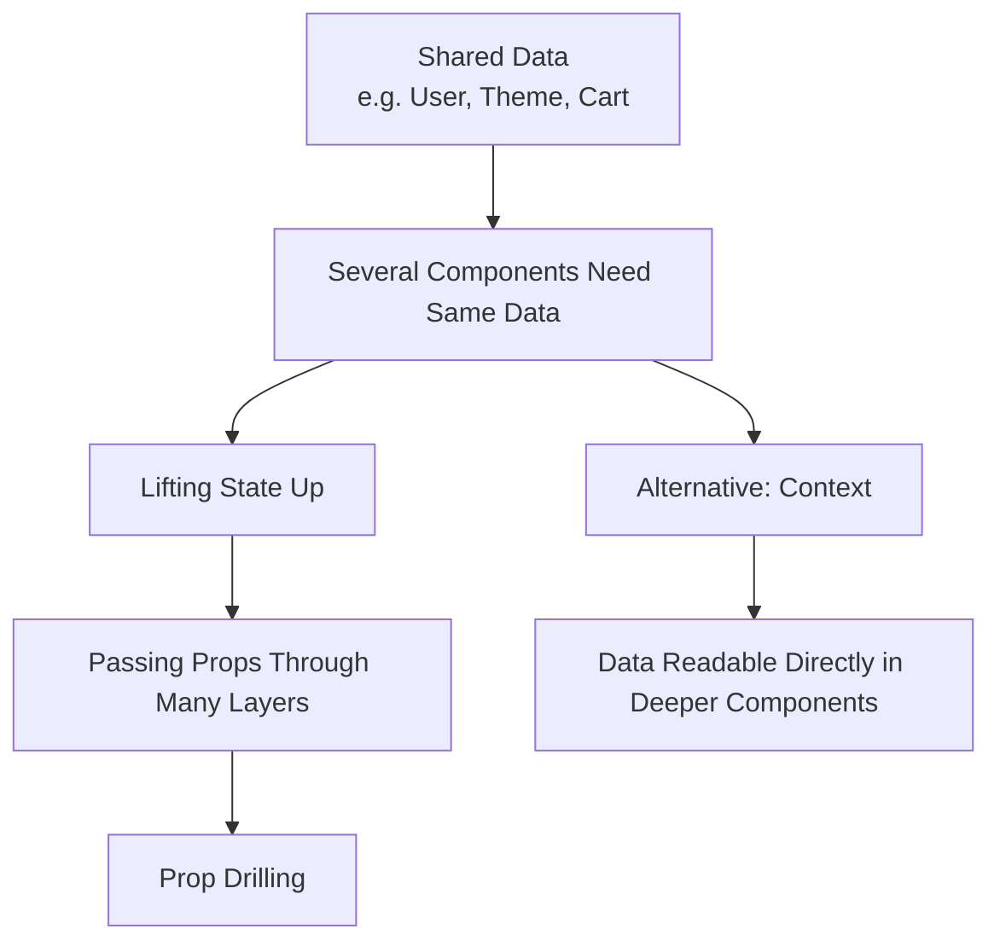
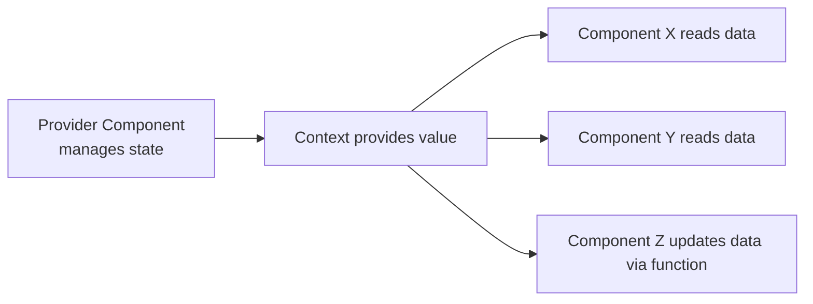

###### Topics

Global State Management in React

- Motivation and challenges of global state management
- Differences between local and global state
- When Context makes sense and when it doesn't

React Context API

- Fundamentals and principles of the Context API
- Creating and providing your own Context
- Reading and using global data in components

# 🌍 Global State Management in React

When you start with React, almost everything works wonderfully with **local state** at first. A component has an input field, a button, or an open/close toggle for a menu, and that component manages its own state with `useState`. That’s simple, clear, and usually the best solution.

But as soon as **multiple components need the same data**, things get more complicated. Imagine you have the currently logged-in user, the selected theme, the language, the shopping cart, or filter settings. This data is often needed not just in one place, but simultaneously in the header, a sidebar, on a product page, and maybe even in a form. React fundamentally recommends "lifting state up" to the next common parent component ([Sharing State Between Components](https://react.dev/learn/sharing-state-between-components)). But in larger applications, this quickly creates organizational pressure.



<br><br><br>
## 🎯 Motivation and Challenges of Global State Management

The most important reason for global state management is: **certain data doesn’t belong to just one component**. It affects a larger part of the application. If you store such data only locally, you quickly end up with multiple copies of the same information. Then, it can happen that one component shows a “dark theme” while another still thinks it’s “light”. Global state management ensures there is **a reliable source** for this data.

A typical problem is **prop drilling**. This means data is passed as props through multiple intermediate components, even though those components don't need the data themselves. React describes Context exactly as the solution for making information available deep in the component tree without having to pass props through many levels ([Passing Data Deeply with Context](https://react.dev/learn/passing-data-deeply-with-context)). Prop drilling isn’t “forbidden”, but it often makes code unnecessarily tangled: Parents know too much about their children, and changes to the data flow ripple through many files.

A second challenge is **responsibility for changes**. If several components are allowed to change the same state, you need to clearly define **who** updates **what** and **when**. Otherwise, you end up with hard-to-trace bugs. This is especially important for data like authentication, global filters, or complex form steps. The more central the state becomes, the more important it is to have a clear structure.

A third challenge is **performance**. When global state changes, many components can be affected. With React Context, if the `value` of a provider changes, React rerenders all components that read from that Context. The comparison uses `Object.is` ([useContext](https://react.dev/reference/react/useContext)). This is functionally correct but can be problematic if you put a lot of frequently changing data into a single Context.

So, global state management is not just "convenient" but always a balance between **convenience**, **structure**, **traceability**, and **render costs**. That’s why it’s important to understand when global state is really useful and when local state is the better choice.

<br><br><br>
## ⚖️ Differences Between Local and Global State

Local state in React usually belongs where it originates and is used. That’s the natural default. Only when multiple components need to coordinate the same state do you lift it up to a common place ([Sharing State Between Components](https://react.dev/learn/sharing-state-between-components)).

| Aspect            | Local State                                 | Global State                        |
|-------------------|---------------------------------------------|-------------------------------------|
| Scope             | Just one component or small subtree         | Multiple, often distant components  |
| Typical Technique | `useState`, `useReducer` in a component     | Context, reducer + Context, external stores |
| Examples          | Input value, dropdown open/close, tab selection | Current user, theme, language, cart        |
| Advantage         | Simple, encapsulates logic cleanly          | Shared data available in many places   |
| Disadvantage      | Hard to share over deep trees               | Needs more structure, possible unnecessary rerenders |

Local state is especially good when the information **only concerns a single UI spot**. A search field keeps its current input value local. A dialog keeps track of being open locally. An accordion remembers locally which section is expanded. This state doesn’t need to be made global, as that would unnecessarily complicate the app.

Global state makes sense when data **needs to be read or changed by multiple components**. Important: "global" in React doesn’t automatically mean "across the whole app". A Context always applies only to the subtree **underneath** its provider ([useContext](https://react.dev/reference/react/useContext)). You can also make state global only for a specific part of the app, like just for the checkout process or just for an admin area.

A common misconception is equating global state with “more important state”. That’s not true. State becomes global not because it’s important, but because it **needs to be shared**. A very important piece of information can be local if it’s only used in one place. Conversely, even a relatively simple piece of data can be global if it’s needed in many places—like the current color scheme.

<br><br><br>
## 🧭 When Context Makes Sense and When It Doesn't

Context makes sense when you **need the same data in many components at different levels**. React cites typical examples like the current theme, the logged-in user, or routing information ([Passing Data Deeply with Context](https://react.dev/learn/passing-data-deeply-with-context)). These are exactly the situations where props would become tedious across many levels.

Context is also useful when the state **conceptually belongs together** and shouldn't be maintained separately in each subcomponent. A good example is a user session: Many components want to know if a user is logged in, what their name is, and what role they have. Instead of maintaining this data separately in many places, a centrally provided Context is much clearer.

Context is not suitable for purely **local state**. If only one component or two closely related components need something, props or local state are usually simpler. React also shows that some prop drilling problems can be solved by **composition**—for instance, by passing JSX or child components instead of data through multiple layers ([Passing Data Deeply with Context](https://react.dev/learn/passing-data-deeply-with-context)). So Context is not always the first step, but more the right tool when props and composition become unwieldy.

A single large “mega-context” that contains many different, frequently changing pieces of data is generally not recommended. The reason is rendering behavior: if the Context value changes, all components that read that Context update ([useContext](https://react.dev/reference/react/useContext)). If a Context contains theme, user, cart, filters, notifications, and live data all at once, a tiny change can unnecessarily rerender many components. In practice, it’s often better to create **several smaller Contexts**, such as a `ThemeContext`, an `AuthContext`, and a `CartContext`.

You can remember: **Context is good for sharing commonly used data but is not automatically the best solution for every kind of state**. Especially for frequently changing, large, or very complex domain states, you often need additional structure—such as using `useReducer` with Context or a specialized state management solution.

<br><br><br>
# 🧩 React Context API

The React Context API is a built-in mechanism that allows a parent component to provide information to all nested components without having to pass that information as props through every intermediate layer ([Passing Data Deeply with Context](https://react.dev/learn/passing-data-deeply-with-context)). This is the core idea: **Provide data centrally and read it conveniently deep down the tree**.

It’s important not to confuse Context with a full state management system. Context **doesn’t automatically store your state**. The state itself usually still resides in `useState` or `useReducer`. Context mainly ensures that this state and the associated functions can be **distributed across many components**. So Context is more of a **transport mechanism** for shared data.



<br><br><br>
## 📘 Fundamentals and Principle of the Context API

The typical process consists of three steps:

1. You **create a Context** with `createContext`.
2. You **provide a value** using a Provider.
3. You **read the value** in child components with `useContext`.

React describes `createContext` as a way to create a Context that components can read or provide ([createContext](https://react.dev/reference/react/createContext)). This Context is initially just a “container” or more precisely a reference to a shared channel. The real data is passed in later via the Provider.

A key point is the **default value** of `createContext`. If you write `createContext('light')`, `'light'` is just a fallback, used when there’s **no corresponding Provider** above the consuming component. React explicitly describes this default value as a static “final fallback” that doesn’t change on its own ([createContext](https://react.dev/reference/react/createContext)). Meaning: The default value doesn't replace a real Provider, but just makes the Context more robust or easier for testing.

When reading, React always uses the **nearest Provider above** the component. If several Providers for the same Context are nested, `useContext` uses the innermost suitable value ([useContext](https://react.dev/reference/react/useContext)). This lets you assign different values to the same Context in different parts of your app.

React 19 introduces a small but pleasant simplification: You can render the Context itself directly as a Provider, for example `<ThemeContext value={theme}>` instead of the older `<ThemeContext.Provider value={theme}>`. React officially documents this as the new Provider syntax starting with React 19 ([createContext](https://react.dev/reference/react/createContext)). Since your main context is React 19, you should be familiar with this newer syntax.

<br><br><br>
## 🛠️ Creating and Providing Your Own Context

### 🧱 Creating a Context

First, create the Context in its own file. This makes it clear **which channel** exists and **which components** are allowed to use it.

```jsx
// ThemeContext.js
import { createContext } from 'react';

export const ThemeContext = createContext(null);
```

With `createContext(null)` you create the Context. `null` here is the fallback value. This means: If someone uses `useContext(ThemeContext)` without an enclosing Provider, the component receives `null` ([createContext](https://react.dev/reference/react/createContext)). In real apps, the default value is often either `null` or a deliberately sensible test/fallback value.

### 🏗️ Building a Provider

To make the Context useful, you usually need a custom Provider component. This is where the actual state lives, often via `useState` or `useReducer`.

```jsx
// ThemeProvider.js
import { useState } from 'react';
import { ThemeContext } from './ThemeContext';

export function ThemeProvider({ children }) {
  const [theme, setTheme] = useState('dark');

  function toggleTheme() {
    setTheme(current => (current === 'dark' ? 'light' : 'dark'));
  }

  const value = {
    theme,
    toggleTheme,
  };

  return (
    <ThemeContext value={value}>
      {children}
    </ThemeContext>
  );
}
```

A lot of important stuff is happening here. `ThemeProvider` manages the `theme` state locally with `useState`. So, this state is at first **just normal React state**. It’s only through `<ThemeContext value={value}>` that it becomes available to all nested components ([createContext](https://react.dev/reference/react/createContext)).

The value passed is an object with two things:

- `theme`: the current global data
- `toggleTheme`: a function that allows other components to update this data

This is a very typical pattern. A Context usually provides not just data, but also **actions** to modify that data.

### 🧩 Including the Provider in Your App

Now the Provider must wrap the part of the app where the data should be available.

```jsx
// App.jsx
import { ThemeProvider } from './ThemeProvider';
import { Layout } from './Layout';

export default function App() {
  return (
    <ThemeProvider>
      <Layout />
    </ThemeProvider>
  );
}
```

From now on, all components **inside** `ThemeProvider` can access the Theme Context. Components outside this area can’t see it. This again shows: Context is not automatically “magically everywhere”, but only applies to the subtree below the Provider ([useContext](https://react.dev/reference/react/useContext)).

### 🧠 What Makes a Good Provider

A clean provider usually has exactly one job: It bundles **related global data** and their mutations. A `ThemeProvider` handles theme matters. An `AuthProvider` deals with user and login state. A `CartProvider` takes care of the shopping cart. This separation makes your code easier to understand and prevents a single Context from becoming too big and confusing.

When a provider passes an object as `value`, it’s important to know that React compares old and new values with `Object.is` ([useContext](https://react.dev/reference/react/useContext)). If you create a new object on every render, this can lead to additional updates. In simple examples, this isn’t a problem, but in larger apps, you often optimize provider values so that Context changes are more controlled.

<br><br><br>
## 👀 Reading and Using Global Data in Components

### 📖 Reading Context with `useContext`

Once the Provider is set up, child components can read the value using `useContext`.

```jsx
// Toolbar.jsx
import { useContext } from 'react';
import { ThemeContext } from './ThemeContext';

export function Toolbar() {
  const { theme, toggleTheme } = useContext(ThemeContext);

  return (
    <div className={`toolbar toolbar--${theme}`}>
      <p>Current theme: {theme}</p>
      <button onClick={toggleTheme}>Toggle theme</button>
    </div>
  );
}
```

`useContext(ThemeContext)` returns the value of the **nearest** `ThemeContext` provider above this component ([useContext](https://react.dev/reference/react/useContext)). In our example, that's the object `{ theme, toggleTheme }`. That lets `Toolbar` read the global data and initiate a global change at the same time.

This feels very convenient in practice because the component doesn’t need to know how the data would have been passed through intermediate components. It just “asks” Context directly. That’s the big practical advantage over long prop chains.

### 🔄 Updating Global Data

Context itself doesn't change anything. The state is always updated in the provider. In our example, `toggleTheme` calls `setTheme` internally. This changes the state in the provider, updating the Context `value`, and all components that read from that Context receive the new value ([useContext](https://react.dev/reference/react/useContext)).

This is crucial: **The logic for writing resides centrally, the reading components stay simple.** So you usually provide not just raw data via Context, but also functions like `login`, `logout`, `addToCart`, `removeItem`, `setLanguage`, or `toggleTheme`.

Here’s another typical example—a user (auth) Context:

```jsx
// AuthContext.js
import { createContext } from 'react';

export const AuthContext = createContext(null);
```

```jsx
// AuthProvider.js
import { useState } from 'react';
import { AuthContext } from './AuthContext';

export function AuthProvider({ children }) {
  const [user, setUser] = useState({
    name: 'Mila',
    role: 'admin',
  });

  function logout() {
    setUser(null);
  }

  return (
    <AuthContext value={{ user, logout }}>
      {children}
    </AuthContext>
  );
}
```

```jsx
// Header.jsx
import { useContext } from 'react';
import { AuthContext } from './AuthContext';

export function Header() {
  const auth = useContext(AuthContext);

  if (!auth?.user) {
    return <header>Not logged in</header>;
  }

  return (
    <header>
      Hello, {auth.user.name} ({auth.user.role})
      <button onClick={auth.logout}>Log out</button>
    </header>
  );
}
```

This is already true global state usage: `Header` doesn’t need props from above, but reads user info directly from Context.

### 🧭 Important Rules When Reading Context

A component only receives the Context value if there’s a matching provider **above** it. If the provider is missing, the default value from `createContext` is used ([createContext](https://react.dev/reference/react/createContext)). That’s why, in real projects, you often see guard logic, such as a custom hook like `useTheme()` that throws an error if the Context is `null`. This way, you immediately notice if a provider was forgotten.

Also note: If the same Context is nested multiple times, the **nearest provider** always takes precedence ([useContext](https://react.dev/reference/react/useContext)). This can be very useful. You could, for example, set a dark theme as the default for the whole app, then override it with a light theme in a specific area.

```jsx
<ThemeContext value={{ theme: 'dark' }}>
  <Page />

  <ThemeContext value={{ theme: 'light' }}>
    <PreviewPanel />
  </ThemeContext>
</ThemeContext>
```

In this example, `PreviewPanel` sees the light theme because it’s closer to the inner provider. Other components outside this inner block still see the dark theme.

### 🧠 Practical Considerations for React 19

For React 19, the new provider syntax is especially important: Instead of `<SomeContext.Provider value={...}>` you can now directly write `<SomeContext value={...}>` ([createContext](https://react.dev/reference/react/createContext)). This doesn’t change the principle, but makes code a little more concise and modern.

Yet the core rule remains: Context is strongest when you **cleanly provide stable, shared data** for a well-defined part of the app. It’s ideal for theme, authentication, language, or similar cross-cutting concerns. For small local UI states, Context would be overkill, and for very large or rapidly changing states, you should plan structure especially carefully, since Context changes can update all consuming components ([useContext](https://react.dev/reference/react/useContext)).